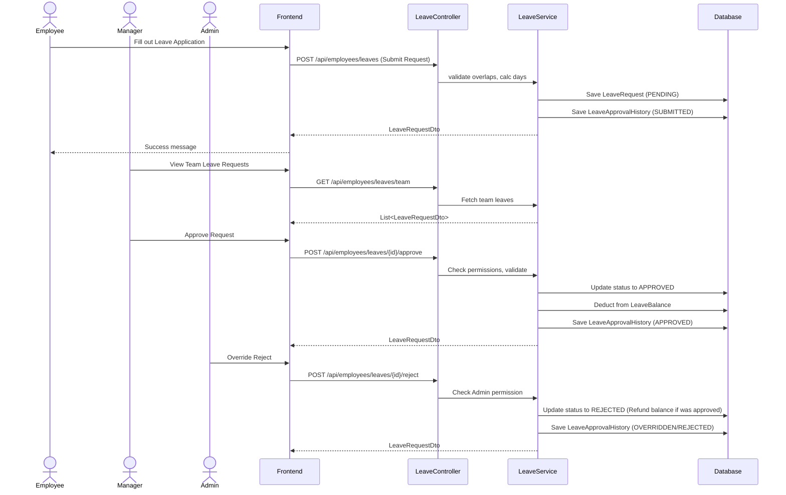

# Leave Management Module Documentation

## Architecture Flow

This module is designed to operate seamlessly within the existing `employee-service`. 
It manages employee leave life-cycles, balances, and multi-tier approval workflows (Manager and HR/Admin Override).



## API Specifications

### Employee Endpoints

1. **Submit a Leave Request**
   - **POST** `/api/employees/leaves`
   - **Body**: `{ "leaveTypeId": 1, "startDate": "2026-08-01", "endDate": "2026-08-05", "reason": "Vacation" }`
   - **Response**: `LeaveRequestDto`

2. **Edit a Pending Leave Request**
   - **PUT** `/api/employees/leaves/{id}`
   - **Body**: `{ "leaveTypeId": 1, "startDate": "2026-08-02", "endDate": "2026-08-06", "reason": "Vacation Update" }`
   - **Condition**: Only allowed if the status is still `PENDING`.

3. **Cancel a Leave Request**
   - **POST** `/api/employees/leaves/{id}/cancel`
   - **Condition**: Only allowed for the request owner. Status becomes `CANCELLED`.

4. **Get My Leave Requests**
   - **GET** `/api/employees/leaves/my-requests`
   - **Response**: `List<LeaveRequestDto>`

5. **Get My Leave Balances**
   - **GET** `/api/employees/leaves/my-balances?year={YYYY}`
   - **Response**: `List<LeaveBalanceDto>` (Includes Total, Used, Pending, Remaining calculations)

### Manager / HR Endpoints

1. **Get Team Leave Requests**
   - **GET** `/api/employees/leaves/team`
   - **Response**: `List<LeaveRequestDto>` (Requests from employees who report to the current user)

2. **Get All Leave Requests (HR/Admin)**
   - **GET** `/api/employees/leaves/all`
   - **Response**: `List<LeaveRequestDto>`

3. **Approve Leave Request**
   - **POST** `/api/employees/leaves/{id}/approve`
   - **Body**: `{ "comments": "Enjoy your trip!" }`
   - **Permission**: Manager of the employee OR HR/Admin.

4. **Reject Leave Request**
   - **POST** `/api/employees/leaves/{id}/reject`
   - **Body**: `{ "comments": "Project deadline approaching." }`
   - **Permission**: Manager of the employee OR HR/Admin.

## Testing & Setup Steps

1. **Seed Leave Types and Balances**: You need to insert initial Data for LeaveTypes and allocate balances to test users.
   - Example PostgreSQL Script:
     ```sql
     -- Create basic leave types
     INSERT INTO leave_types (name, description, default_days, requires_attachment, created_at, updated_at) 
     VALUES ('Annual', 'Annual Paid Leave', 20, false, CURRENT_TIMESTAMP, CURRENT_TIMESTAMP);
     
     INSERT INTO leave_types (name, description, default_days, requires_attachment, created_at, updated_at) 
     VALUES ('Sick', 'Sick Leave', 10, true, CURRENT_TIMESTAMP, CURRENT_TIMESTAMP);
     
     -- Assign balance to an employee (assuming employee_id 1)
     INSERT INTO leave_balances (employee_id, leave_type_id, year, total_days, used_days, created_at, updated_at)
     VALUES (1, 1, 2026, 20, 0, CURRENT_TIMESTAMP, CURRENT_TIMESTAMP);
     
     INSERT INTO leave_balances (employee_id, leave_type_id, year, total_days, used_days, created_at, updated_at)
     VALUES (1, 2, 2026, 10, 0, CURRENT_TIMESTAMP, CURRENT_TIMESTAMP);
     ```

2. **Test End-to-End Workflow**:
   - Login as an Employee and go to **My Space -> Leave**.
   - Create an Annual Leave Request (Observe pending status).
   - Log out and login as their Manager. Go to **Manager Workspace -> Leave**.
   - Verify the request appears under Team Leave Requests. Approve the request.
   - Login as HR/Admin. Go to **HR Central -> Leave**.
   - Review the company-wide Leave Applications and optionally override the status.

3. **Validation testing**:
   - Apply for a leave on Saturday & Sunday (Should report 0 working days).
   - Apply for a leave that overlaps with a previously approved leave (Should be rejected).
   - Apply for a leave exceeding the balance limit (Should be rejected).
